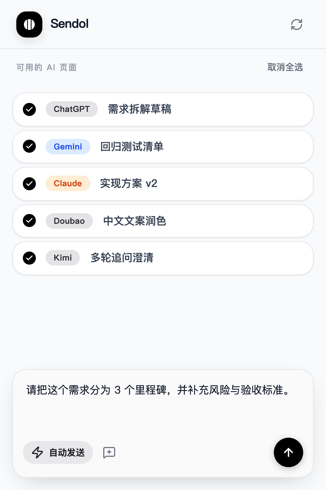

# Sendol

<p align="center">
  <a href="README_CN.md">简体中文</a> | <strong>English</strong>
</p>

**Broadcast one message to all AI chat windows at once.** A Chrome/Edge extension for power users who juggle ChatGPT, Claude, Gemini, DeepSeek, Kimi, Doubao, and Yuanbao.

<!-- Use a fixed width to avoid GitHub scaling blur; source image is 1024px for Retina displays -->


<!-- Keep screenshot width fixed to reduce GitHub compression blur -->


---

## 💡 Features

| Feature | Description |
|---------|-------------|
| **One input, sync everywhere** | Type once, send to all open AI tabs. |
| **Simultaneous send** | Two-phase broadcast: inject to all tabs first, then trigger send at once. |
| **Smart loading feedback** | Send button uses a soft timeout (~50s); if longer, UI exits loading and keeps progress in background. |
| **Auto Send** | Submit to each AI without clicking Send in every tab. |
| **New Chat** | Optionally start a new conversation on each platform. |
| **Minimal UI, keyboard-first** | Clean design, `Ctrl+Enter` to send. |

## 🔄 Recent Updates

<!-- AUTO_README_UPDATES_START -->
- 2026-03-20 14:42 | v1.2.21 (PATCH) | Core | `app/src/components/layout/Footer.jsx` <!-- auto:791e9c40075e -->
- 2026-03-20 14:41 | v1.2.20 (PATCH) | Core | `app/src/components/layout/Header.jsx` <!-- auto:bba3fd0c7f45 -->
- 2026-03-20 14:39 | v1.2.19 (PATCH) | Tooling | `scripts/capture-popup-screenshot.mjs` <!-- auto:c0008c4646d5 -->
- 2026-03-20 14:25 | v1.2.18 (PATCH) | Core | `app/src/components/layout/Hero.jsx` <!-- auto:5ed6e7de1d74 -->
- 2026-03-20 14:22 | v1.2.17 (PATCH) | Core | `app/src/components/layout/Hero.jsx` <!-- auto:978f7e67ef4e -->
- 2026-03-20 14:20 | v1.2.16 (PATCH) | Core | `app/src/components/layout/Hero.jsx` <!-- auto:65815068e781 -->
- 2026-03-20 14:12 | v1.2.15 (PATCH) | Core | `app/src/components/layout/Hero.jsx` <!-- auto:c44975002235 -->
- 2026-03-20 13:51 | v1.2.14 (PATCH) | Core | `app/src/components/layout/Hero.jsx` <!-- auto:a18a5a967490 -->
- 2026-03-20 13:51 | v1.2.13 (PATCH) | Core | `app/src/components/layout/Hero.jsx` <!-- auto:258980a549a6 -->
- 2026-03-20 13:49 | v1.2.12 (PATCH) | Core | `app/src/components/layout/Hero.jsx` <!-- auto:a8ff17cd963d -->
- 2026-03-20 13:46 | v1.2.11 (PATCH) | Core | `app/src/components/layout/Hero.jsx` <!-- auto:47c9fe3130a6 -->
- 2026-03-20 13:45 | v1.2.10 (PATCH) | Core | `app/src/components/layout/Hero.jsx` <!-- auto:c4faeef286c6 -->
<!-- AUTO_README_UPDATES_END -->

---

## 🚀 Supported Platforms

| Platform | Official URL |
|----------|--------------|
| ChatGPT (OpenAI) | chatgpt.com, chat.openai.com |
| Claude (Anthropic) | claude.ai |
| Gemini (Google) | gemini.google.com |
| DeepSeek | chat.deepseek.com |
| Doubao (ByteDance) | www.doubao.com |
| Yuanbao (Tencent) | yuanbao.tencent.com |
| Kimi (Moonshot) | kimi.com, kimi.moonshot.cn, kimi.ai |

---

## 🛠 Installation

This extension is not on the Chrome Web Store yet. Load it manually in **Developer mode**:

1. **Get the code**
   - Click **Code** → **Download ZIP**, then unzip.
   - Or Git clone: `git clone https://github.com/RainTreeQ/sendol-extension.git`
2. **Open extensions**
   - Chrome: `chrome://extensions/`
   - Edge: `edge://extensions/`
3. Turn on **Developer mode** (toggle in top-right corner).
4. Click **Load unpacked**.
5. Select the **project root folder** (the one containing `manifest.json`).
6. Popup entry is `app/dist-extension/popup.html` (prebuilt in repo). If missing locally, run `npm run build:extension` in project root once.

## 🎯 Usage

1. Open the AI sites you need (e.g. ChatGPT, Claude, Gemini) in separate tabs.
2. Click the **Sendol** icon in the toolbar.
3. The extension scans and lists all detected AI tabs.
4. Type your message in the input box.
5. (Optional) Enable **Auto Send** and/or **New Chat**.
6. Press **Ctrl+Enter** (or Cmd+Enter on Mac) or click Send to broadcast.

---

## ⚠️ Behavior Notes

- Some sites only expose the message input after login; if not logged in, detection may fail.
- The send button loading has a soft timeout (about 50 seconds). If exceeded, popup shows background-progress text and continues processing.
- Safe guard rules are enabled for auto text injection by default. Risk controls are evaluated automatically in background and can temporarily disable auto-send.
- Image upload keeps the safest default path: manual upload on each platform tab. You can use **Locate Upload** to highlight likely upload entries (still no automatic cross-site image upload).
- Microsoft Copilot / Bing is intentionally out of scope in current versions.

---

## 🌐 Website

- **Landing Page**: [https://sendol.chat](https://sendol.chat) - Features, pricing, and installation
- **Design System**: `/design-system` - Internal component documentation

Local preview:
```bash
npm run dev --prefix app
# Open http://localhost:5173/ (landing) or http://localhost:5173/design-system
```

Build commands:
```bash
npm run build:site
npm run build:design-system
```

---

## 📂 Development

**Which files affect what**

| Module | Files | How to apply changes |
|--------|-------|---------------------|
| Popup UI (source) | `app/src/popup/`, `app/src/components/ui/`, `app/src/index.css` | Run `npm run build:extension`, then reload in chrome://extensions |
| Popup UI (runtime) | `app/dist-extension/` | Build output, do not edit manually |
| Landing / Site runtime | `app/dist-site/` | Build output, not used by extension |
| Background / Broadcast logic | `background.js` | Save file, then reload in chrome://extensions |
| Content scripts & Platform adapters | `content*.js`, `shared/platform-registry.js` | Same as above |
| Extension config & permissions | `manifest.json` | Same as above |

See [app/docs/L3-EXTENSION-INTEGRATION.md](app/docs/L3-EXTENSION-INTEGRATION.md) for details.

**Release checklist**

- `npm run build:extension`
- `npm run package:extension` (generates minified release package and size report)
- `npm run test:popup`
- `npm run release:stage` (builds and stages `app/dist-extension/`)

---

## 🔒 Privacy & Security

This extension runs **entirely on your device**. It uses a local broadcast flow only — **no collection, storage, or upload** of your chats, passwords, or any personal data.

See [Privacy Policy](privacy.md) for details.

---

## 📄 License

Starting from **v2.0.0**, this project is dual-licensed:

- **Open-source**: [GNU AGPL-3.0-or-later](LICENSE)
- **Commercial**: [Commercial Licensing Notice](COMMERCIAL_LICENSE.md)
- **Branding**: [Trademark Policy](TRADEMARK_POLICY.md)

Historical releases published under MIT (such as `1.x`) remain under MIT for the corresponding released code.
